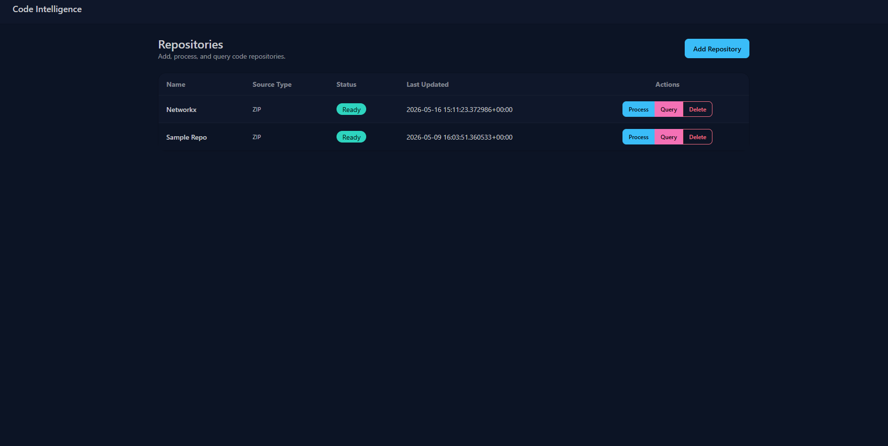
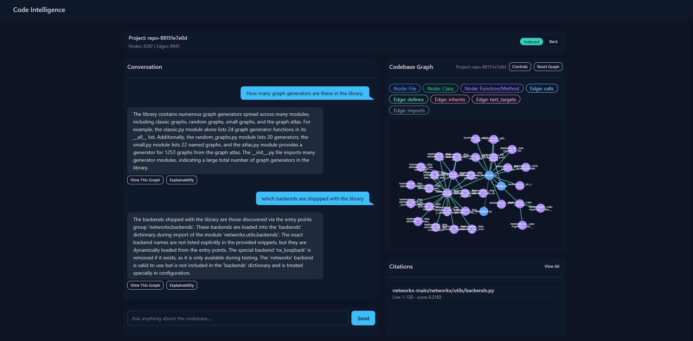
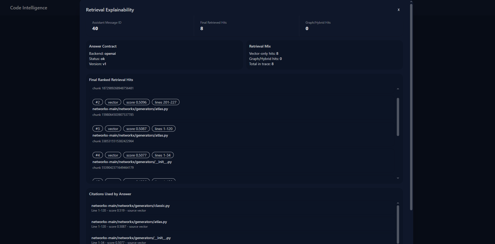
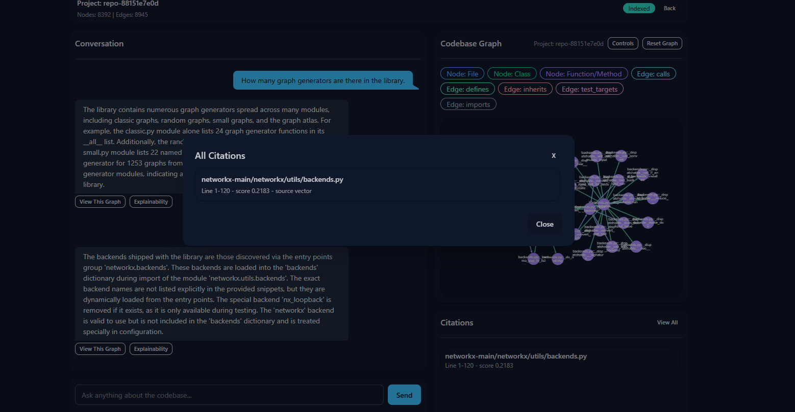

# CodeIntelligence: Hybrid RAG for Codebases

A project that builds a hybrid retrieval system over source code using:

- Django (app + SSR/HTMX UI)
- Qdrant (vector retrieval)
- Graph retrieval over persisted code graph (NetworkX + SQLite models)
- Tailwind + DaisyUI + Jinja templates

## What It Does

1. Ingests a repository (zip or folder upload).
2. Chunks code files and stores embeddings in Qdrant.
3. Builds and persists a multi-relation code graph (`imports`, `defines`, `calls`, `inherits`, `test_targets`).
4. Answers natural-language questions with citations and graph-aware context.
5. Stores conversations, answer traces, and per-turn graph snapshots.

## Retrieval Flow (Hybrid RAG)

1. User asks a query.
2. Vector seed retrieval gets top-k chunks by semantic similarity.
3. Seed file paths expand through graph relations.
4. Graph-expanded paths are used for second-pass vector retrieval.
5. Results are merged, deduplicated, and reranked (hybrid scoring).
6. Top contexts become:
    - answer context for LLM synthesis
    - citation payload for UI
    - explainability trace for later inspection

Reference doc: [rag-flow.md](F:\Projects\django\codeintelligence\rag-flow.md)

## UI Screenshots (Placeholders)

Add real screenshots in this section later.

### Dashboard

### Query Workspace

### Explainability Modal

### Citations Modal

## Evaluation Snapshot

Latest reported run:

- `file_hit_rate@8`: **0.90**
- `mean_file_recall@8`: **0.85**
- `symbol_hit_rate@8`: **0.9333**
- `mean_graph_or_hybrid_ratio`: **0.1167**
- `graph_helped_hit_rate@8`: **0.10**
- `latency p50/p95`: **~529ms / ~831ms**

Interpretation:

- Retrieval quality is strong for file/symbol grounding.
- Latency is in a usable range for interactive query UX.
- Graph contribution is present but still lower than desired for a strongly “graph-led” hybrid experience.

## Explainability and Observability

- Per-answer explainability panel with retrieval trace.
- Source mix visibility (`vector` vs `graph` vs `hybrid`).
- Eval harness:
- `python manage.py rag_eval --project-id <id> [--warmup]`
- Run-to-run comparison:
- `python manage.py rag_eval_compare --baseline <path> --candidate <path>`

## Current Shortcomings

1. Graph-assisted retrieval impact is limited (`graph_helped_hit_rate` is low).
2. Large repository graphs can still stress browser rendering without stricter view-level sampling.
3. Retrieval scoring remains heuristic-heavy and may regress without strict eval gating.
4. Local/remote LLM backend switching should be smoother (especially for offline-first setups).
5. More integration tests are needed for Qdrant + graph persistence/retrieval paths.

## Roadmap (Near-Term)

1. Improve graph participation with safe, incremental retrieval tuning (eval-gated).
2. Add stronger graph-focused eval cases (flow/call-chain/dependency questions).
3. Add robust local LLM backend support (OpenAI-compatible local endpoint path).
4. Expand automated test coverage for retrieval pipeline and failure scenarios.

## Tech Notes

- Templates are Jinja (`.jinja`).
- Shared styles come from global static + Tailwind/DaisyUI theme setup.
- Graph persistence uses Django models and SQLite; vector retrieval uses Qdrant.
